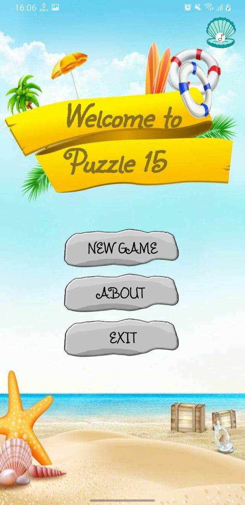
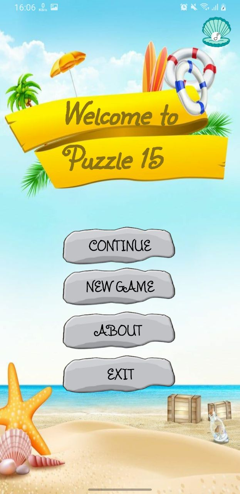
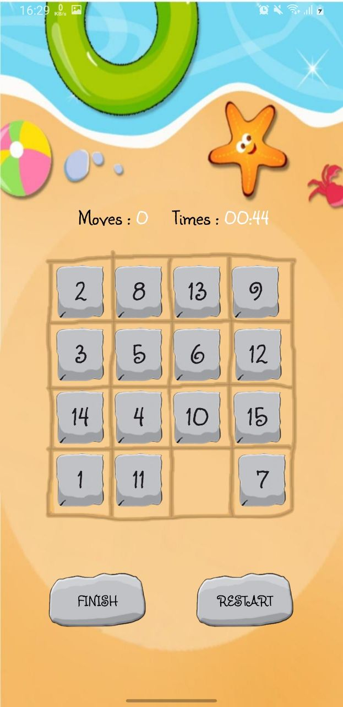
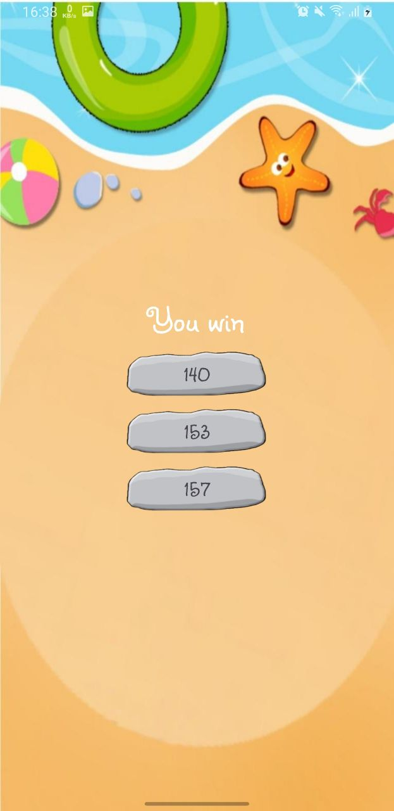
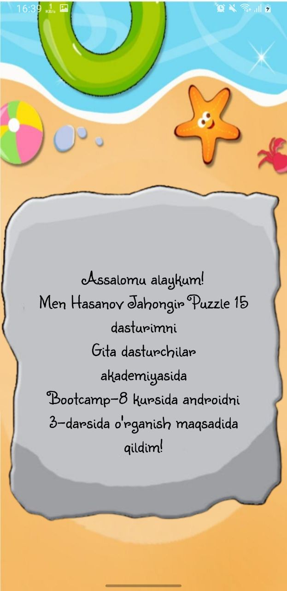

# Puzzle-15
Puzzle 15 is an Android application that lets users play the classic "15 Puzzle" (Sliding Puzzle) game. It includes features like media playback, multi-activity navigation, and saved progress using SharedPreferences.

📌 Features:
Classic 15 Puzzle: A 4x4 grid puzzle where the player slides blocks to arrange them in the correct order.

Game Timer: Tracks the time taken to solve the puzzle and displays the results at the end.

Save Progress: The game progress is saved using SharedPreferences, so users can resume their game at any time.

Dialog Box: A dialog box is used for displaying game instructions, confirmation, or error messages.

MediaPlayer: Used to play sound effects, music, or other media during the gameplay.

Multi-Activity Setup: The app follows a multi-activity structure, where each part of the game (menu, gameplay, result) is in a different activity.

🛠 Technologies:
Android Studio: The app is developed using Android Studio.

Java: Written in Java programming language.

SharedPreferences: Used to save and retrieve user data like the game progress.

MediaPlayer: Utilized to play background music or sound effects.

Multi-Activity Navigation: Uses multiple activities for different sections of the app (e.g., Menu Activity, Game Activity, Result Activity).

Dialogs: Implemented using Dialogs to display information, such as instructions or confirmation messages.

📂 How to Use:
Start the Game: Tap the "Start" button to begin a new game.

Slide the Blocks: Arrange the blocks by sliding them to solve the puzzle.

Game Progress: The game’s progress is saved using SharedPreferences so you can resume from where you left off.

Sound: You can listen to background music or sound effects during the game, managed by MediaPlayer.

Dialogs: Use dialogs for additional instructions, game over messages, or any confirmations.

  
  
  
  
  
  

